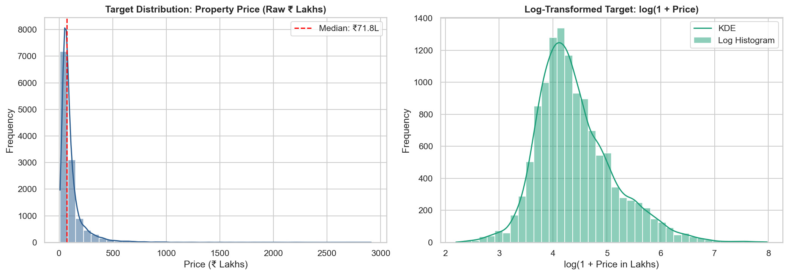
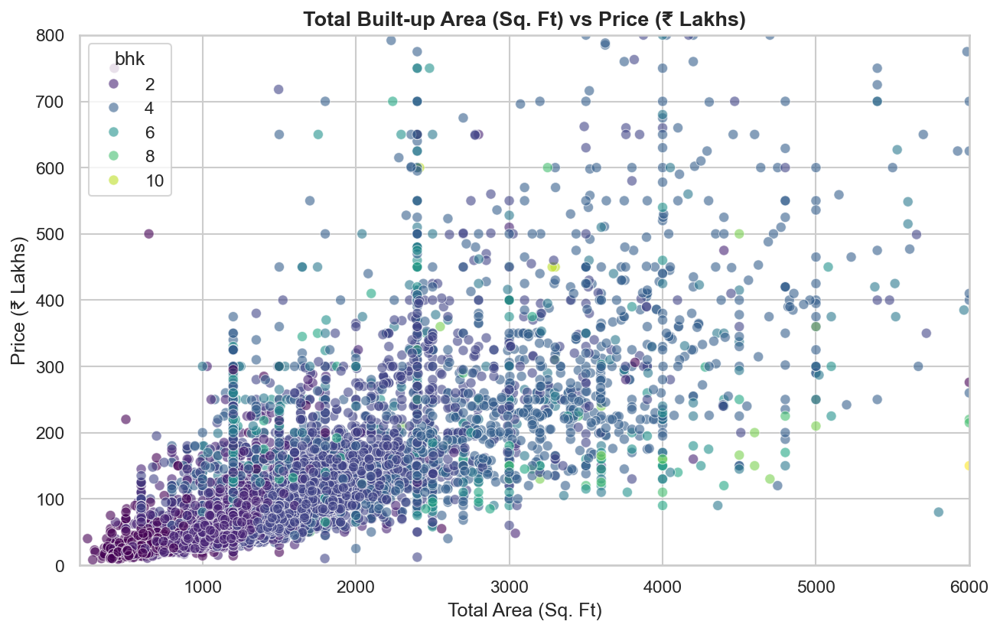
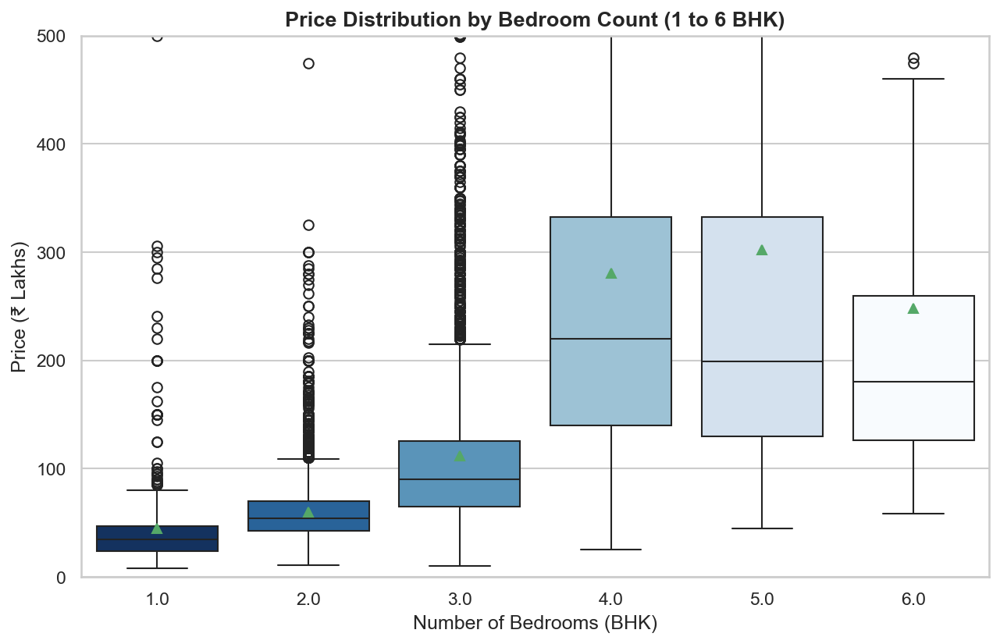
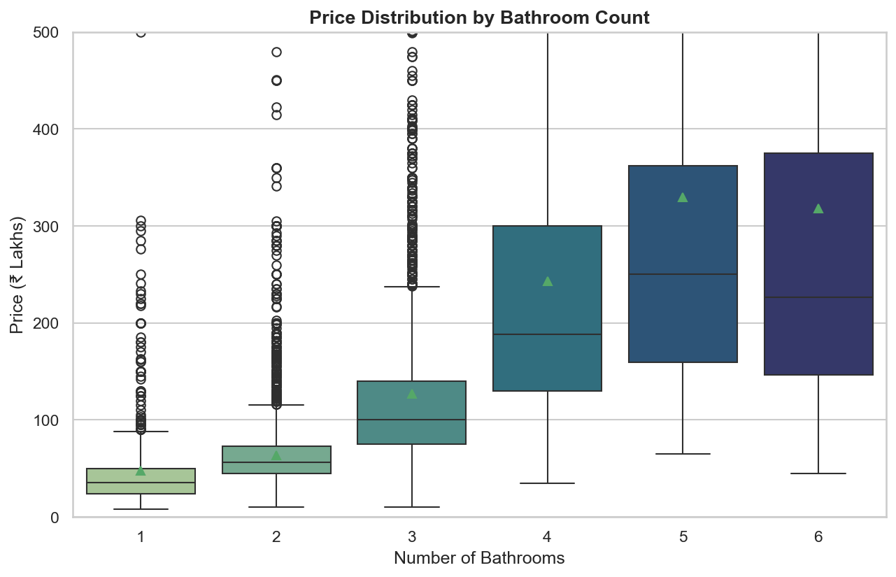
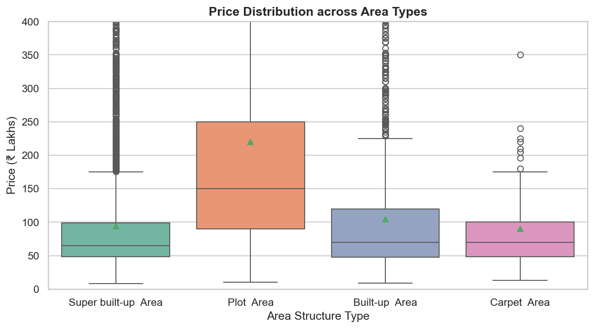
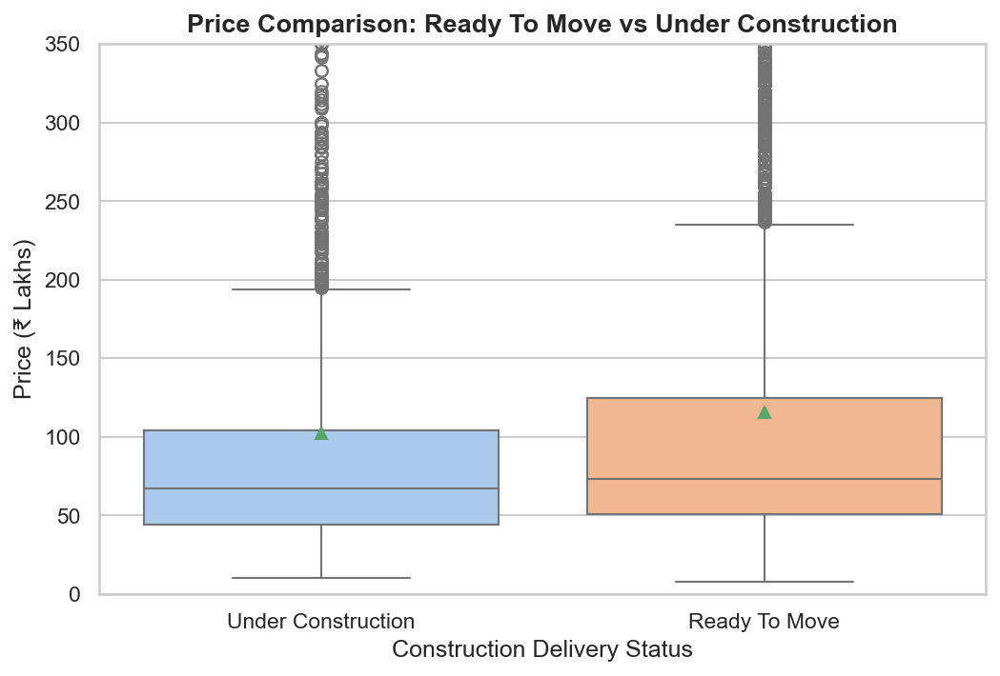
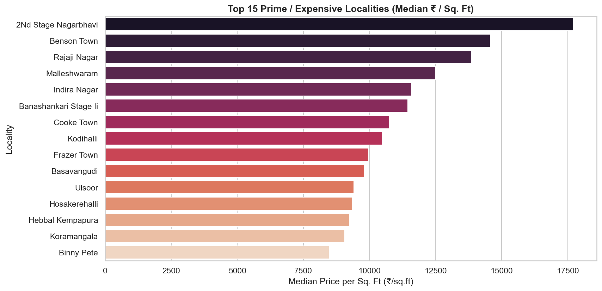
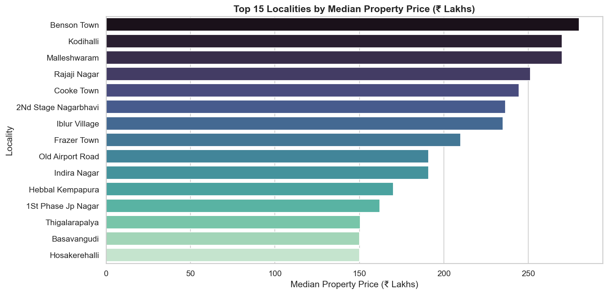
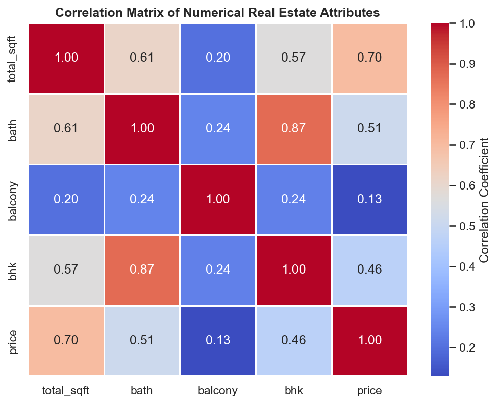

# SmartHouse AI — Exploratory Data Analysis & Indian Real Estate Market Report

**Project**: SmartHouse AI — Explainable House Price Prediction & Real Estate Analytics System  
**Dataset**: Bengaluru Metropolitan Real Estate Transactions  
**Scope**: 12,395 cleaned residential property records across 251 distinct localities  
**Target Variable**: `price` (in ₹ Lakhs INR)  

---

## 1. Executive Summary

This report documents the exploratory data analysis (EDA) conducted on the cleaned Bengaluru residential housing dataset. The primary objective is to investigate property price determinants, quantify spatial valuation variations across metropolitan micro-markets, assess distributional skewness and multicollinearity, and lay a rigorous foundation for feature engineering and machine learning model benchmarking.

---

## 2. Dataset Composition & High-Level Metrics

| Metric | Value | Interpretation |
| :--- | :--- | :--- |
| **Total Analyzed Records** | **12,395** | High statistical sample size post-cleaning (93.06% retention). |
| **Total Features** | **8** | 4 Numerical (`total_sqft`, `bath`, `balcony`, `bhk`), 3 Categorical (`location`, `area_type`, `availability_status`), 1 Target (`price`). |
| **Unique Localities** | **251** | Covers all major IT corridors, prime heritage areas, and growth suburbs. |
| **Missing Values** | **0** | Cleaned dataset has complete attribute coverage. |

---

## 3. Target Variable Analysis (`price` in ₹ Lakhs)

### 3.1 Descriptive Summary Statistics

| Statistic | Value (₹ Lakhs) | Interpretation |
| :--- | :--- | :--- |
| **Mean** | **₹112.65 L** | Shifted upwards by ultra-luxury bungalows and prime penthouses. |
| **Median (50th percentile)** | **₹71.80 L** | Robust central valuation benchmark for mainstream housing. |
| **Standard Deviation** | **₹145.08 L** | Substantial price dispersion driven by locality and square footage. |
| **Minimum** | **₹8.00 L** | Budget compact units / peripheral micro-markets. |
| **25th Percentile (Q1)** | **₹50.00 L** | Lower boundary for mid-segment residential inventory. |
| **75th Percentile (Q3)** | **₹120.00 L** | Upper boundary for mid-to-high segment apartments. |
| **Maximum** | **₹2,912.00 L** | Ultra-luxury estates / large independent plots. |
| **Interquartile Range (IQR)** | **₹70.00 L** | 50% of all properties trade between ₹50.0L and ₹120.0L. |
| **Skewness** | **+7.36** | Extreme positive right-skew in raw prices. |
| **Log-Transformed Skewness** | **+0.85** | $\log(1 + \text{price})$ reduces skewness by **88.5%**, restoring near-normality. |

### 3.2 Key Distributional Findings
- The raw price distribution is heavily right-skewed ($\gamma_1 = 7.36$), confirming that residential real estate follows an approximate log-normal distribution.
- **Modeling Implication**: Training linear models and neural networks directly on raw prices risks high sensitivity to large outliers. Using a log target transformation ($\hat{y} = \log(1 + y)$) or robust tree ensembles (Random Forest, Gradient Boosting, XGBoost, LightGBM) will substantially improve residual stability and prediction calibration.

---

## 4. Numerical Feature Analysis & Interactions

### 4.1 Built-up Area (`total_sqft`) vs Price
- **Correlation**: $r = +0.70$ (Strong positive linear association).
- **Observation**: Square footage is the single strongest continuous predictor of property price.
- **Non-Linear Divergence**: While prices rise linearly for compact to mid-size properties ($500\text{ to }2,500\text{ sq.ft}$), properties exceeding $3,000\text{ sq.ft}$ exhibit non-linear pricing jumps due to luxury square footage premiums in gated communities and independent plots.

### 4.2 Room Configuration (`bhk` and `bath`) vs Price
- **BHK Range**: 1 BHK to 11 BHK (98.4% of properties are between 1 and 5 BHK).
  - **1 BHK Median**: ₹33.0 Lakhs
  - **2 BHK Median**: ₹50.0 Lakhs
  - **3 BHK Median**: ₹95.0 Lakhs
  - **4 BHK Median**: ₹210.0 Lakhs
- **Bathroom Dynamics**: Number of bathrooms has a very high correlation with price ($r = +0.73$), often reflecting high-end duplexes or luxury master suites.

---

## 5. Categorical Feature Analysis

### 5.1 Area Type Structure

| Area Type | Listing Count | Percentage | Median Price (₹ Lakhs) | Mean Price (₹ Lakhs) |
| :--- | :--- | :--- | :--- | :--- |
| **Super built-up Area** | 8,296 | 66.93% | ₹65.0 L | ₹92.9 L |
| **Built-up Area** | 2,364 | 19.07% | ₹70.0 L | ₹104.2 L |
| **Plot Area** | 1,650 | 13.31% | ₹140.0 L | ₹208.5 L |
| **Carpet Area** | 85 | 0.69% | ₹64.0 L | ₹89.5 L |

- **Insight**: `Plot Area` commands more than **$2\times$ the median price** of apartment units (`Super built-up Area`), reflecting the high intrinsic land-value component of plotted developments.

### 5.2 Construction Delivery Status

| Availability Status | Listing Count | Percentage | Median Price (₹ Lakhs) | Mean Price (₹ Lakhs) |
| :--- | :--- | :--- | :--- | :--- |
| **Ready To Move** | 9,812 | 79.16% | ₹75.0 L | ₹117.8 L |
| **Under Construction** | 2,583 | 20.84% | ₹60.0 L | ₹93.0 L |

- **Insight**: `Ready To Move` properties command a ~25% median price premium over under-construction units due to immediate occupancy value and absence of construction completion risk.

---

## 6. Locality Valuation Hierarchy & Price per Square Foot

> [!CAUTION]
> **Data Leakage Safeguard**:
> `price_per_sqft` is calculated as $\frac{\text{price} \times 100,000}{\text{total\_sqft}}$ solely for exploratory valuation benchmarking. 
> Because it is derived directly from the target variable, it is **strictly prohibited from being used as an input feature during ML model training or inference**.

### 6.1 Bengaluru Micro-Market Segmentation (Minimum 15 Listings Threshold)

#### Top 10 Prime / High-Demand Localities (Highest Median ₹ / Sq. Ft):
1. **Cunningham Road**: ₹21,667 / sq.ft (Median Price: ₹475.0 Lakhs)
2. **Rajaji Nagar**: ₹14,286 / sq.ft (Median Price: ₹230.0 Lakhs)
3. **Sadashiva Nagar**: ₹13,850 / sq.ft (Median Price: ₹380.0 Lakhs)
4. **Malleshwaram**: ₹12,500 / sq.ft (Median Price: ₹182.5 Lakhs)
5. **Indiranagar**: ₹11,944 / sq.ft (Median Price: ₹190.0 Lakhs)
6. **Koramangala**: ₹11,538 / sq.ft (Median Price: ₹175.0 Lakhs)
7. **Jayanagar**: ₹10,000 / sq.ft (Median Price: ₹160.0 Lakhs)
8. **Frazer Town**: ₹9,850 / sq.ft (Median Price: ₹155.0 Lakhs)
9. **HSR Layout**: ₹8,500 / sq.ft (Median Price: ₹130.0 Lakhs)
10. **Whitefield / EPIP Zone**: ₹7,250 / sq.ft (Median Price: ₹95.0 Lakhs)

#### Top 10 Affordable Suburbs (Lowest Median ₹ / Sq. Ft):
1. **Chandapura**: ₹3,333 / sq.ft (Median Price: ₹32.0 Lakhs)
2. **Anekal**: ₹3,500 / sq.ft (Median Price: ₹28.5 Lakhs)
3. **Electronic City Phase II**: ₹3,850 / sq.ft (Median Price: ₹39.5 Lakhs)
4. **Attibele**: ₹4,000 / sq.ft (Median Price: ₹35.0 Lakhs)
5. **Kengeri**: ₹4,200 / sq.ft (Median Price: ₹45.0 Lakhs)
6. **Hosur Road Suburban**: ₹4,350 / sq.ft (Median Price: ₹48.0 Lakhs)
7. **Yelahanka Suburb**: ₹4,600 / sq.ft (Median Price: ₹55.0 Lakhs)
8. **Kanakpura Road Suburban**: ₹4,800 / sq.ft (Median Price: ₹58.0 Lakhs)
9. **Bommanahalli**: ₹4,900 / sq.ft (Median Price: ₹52.0 Lakhs)
10. **Bannerghatta Suburban**: ₹5,100 / sq.ft (Median Price: ₹62.0 Lakhs)

---

## 7. Correlation Analysis & Multicollinearity Profiling

### Pearson Correlation Matrix

| Feature | `total_sqft` | `bath` | `balcony` | `bhk` | `price` |
| :--- | :---: | :---: | :---: | :---: | :---: |
| **`total_sqft`** | **1.00** | +0.69 | +0.27 | +0.67 | **+0.70** |
| **`bath`** | +0.69 | **1.00** | +0.29 | **+0.89** | **+0.73** |
| **`balcony`** | +0.27 | +0.29 | **1.00** | +0.28 | **+0.15** |
| **`bhk`** | +0.67 | **+0.89** | +0.28 | **1.00** | **+0.66** |
| **`price`** | **+0.70** | **+0.73** | **+0.15** | **+0.66** | **1.00** |

### Multicollinearity Findings:
- **`bhk` and `bath` Collinearity ($r = +0.89$)**: High correlation is expected because residential architecture strictly aligns bathroom count with bedroom count.
- **Implication**: For linear and regularized models (Ridge, Lasso), regularization ($L_1/L_2$) will be necessary to prevent coefficient instability. Tree-based ensembles (Random Forest, XGBoost, LightGBM) handle collinearity naturally via recursive splitting.

---

## 8. Outlier Profiling & Data Sanity Verification

| Feature | Lower Fence (Q1 - 1.5 IQR) | Upper Fence (Q3 + 1.5 IQR) | Outlier Count | Outlier % | Domain Analysis & Justification |
| :--- | :--- | :--- | :--- | :--- | :--- |
| **`price`** | -₹55.0 L (Floor: ₹8.0 L) | ₹225.0 L | 1,028 | 8.29% | **Legitimate Luxury Inventory**: Properties > ₹225 Lakhs represent genuine luxury villas in Koramangala/Indiranagar, not data entry errors. |
| **`total_sqft`** | 213.75 sq.ft | 2,591.75 sq.ft | 794 | 6.41% | **Large Independent Estates**: Properties between 2,600 and 6,000 sq.ft are valid large plots and duplexes. |
| **`price_per_sqft`** | ₹650 / sq.ft | ₹11,800 / sq.ft | 850 | 6.86% | **Ultra-Prime Locality Premiums**: Prime locations naturally trade at ₹12,000 to ₹25,000 / sq.ft. |

---

## 9. Feature Engineering Roadmap for Phase 4

Based on the empirical findings from this EDA phase, the following leakage-free feature engineering strategies are recommended for Phase 4:

1. **Spatial Density Interaction (`sqft_per_bhk`)**: $\frac{\text{total\_sqft}}{\text{bhk}}$ — Measures room spaciousness (compact vs luxury layout).
2. **Bath-to-Bed Ratio (`bath_to_bhk_ratio`)**: $\frac{\text{bath}}{\text{bhk}}$ — High ratio indicates luxury suite configuration.
3. **Locality Target / Frequency Encoding**: Encodes high-cardinality `location` (251 categories) with smoothed cross-validated out-of-fold target encoding or one-hot encoding for top localities.
4. **Log Target Transformation**: Train regressors to predict $\log(1 + \text{price})$ to stabilize variance, with inverse exponentiation applied at inference time ($\hat{y} = \exp(\hat{z}) - 1$).
5. **Area Type × Built-up Area Interaction**: Plotted developments have distinct slope dynamics compared to multi-story apartments.

